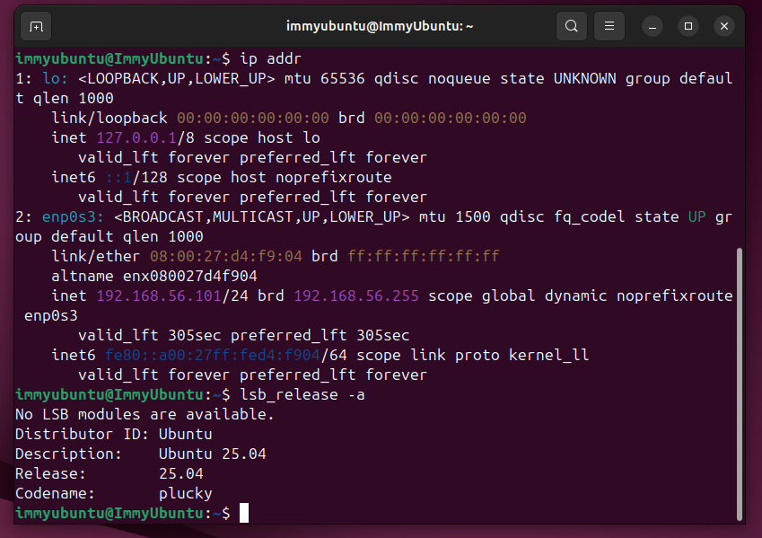

# Phase 1 – System Planning and Distribution Selection

## Objectives
The purpose of this phase is to plan my operating system deployment and justify technical decisions 
---

## 1. System Architecture
In my diagram below I am presenting my Host-Only Network setup which uses Virtual Box. As displayed, my personal workstation, the host laptop, has a direct connection to the Ubuntu Linux Server which is running as a virtual machine. The host and VM are connected by the SHH (Secure Shell) which allows for secure communication. As highlted before this is all done on Virtual Box's shared private network.

**SystemArchitectureDiagram:**  

## 2. Distribution Selection Justification 
Within this project, I have decided to use an Ubuntu Server as my virtual machine. This is because I believe it is best suited to the learning test environment necessary to demonstrate the required skills in command-line proficiency, system configuration, security implementation, and performance analysis as specified in the assessment brief.

One possible alternative to Ubuntu would be Debian. Although Ubuntu is part of the Debian family and both champion stability, Ubuntu is a better choice because it is more user-friendly, has more extensive documentation and community support, and offers Long Term Support (LTS) releases. This also means it provides a higher volume of up-to-date packages, which is particularly useful in a learning and test environment.

Another alternative would be to use Fedora which is a part of the Red-Hat family. Despite it's good reputation for up-to-date software it would still be a bad choice for this particualar project, this is beause unlike Ubuntu, Fedora doesn't have LST, updating every 13 months, hence why it's software is so up to date. However as a result of this, it can't be considered a stable learning/testing enivornment which is required by my project.

## 3. Workstation Configuration Decision 
My workstation, which is my host laptop, operates using Windows 11 Pro and is a Dell XPS 15 9560 with an Intel Core i7-7700HQ CPU. I chose this workstation because it has sufficient processing power and memory to download and run Oracle VirtualBox smoothly. Using my laptop allows me to maintain a dual-system architecture, with the host acting as the workstation and a virtual Ubuntu Server acting as the server, fulfilling the assessment criteria. This configuration provides a practical and efficient environment to perform server administration via the command line. 

## 4. Network Configuration Documenation 
Within this project I have connected my Ubunutu Server with my host laptop via a shared internal network facilitieated and runningthough Oracle Virtual Box and its host only adapter, this is so that there is a secure private communication between the two. Then you can have administrative access thruogh the Safe Shell (SSH) 

In regards to the IP addressing, this is automantically set by Oracle Boxe's built-in DHCP service, thus assigning a private IP address to the Ubuntu Server. The host workstation is tehn also assigned an IP address on the same subnet,which ultimately allows for there to be direct communication between the two systems.

## 5. CLI Specifications Documentation
Below are screenshots of my Command Line terminal with the system specifications

For a quick overview the commands are as follows:

Uname - 
free - 
df -h - 
ip addr - 
lsb_release -a - 

