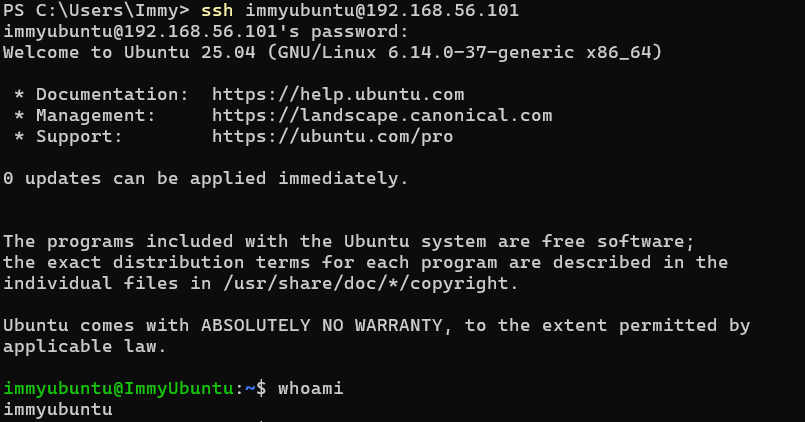
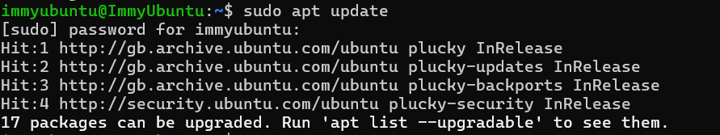
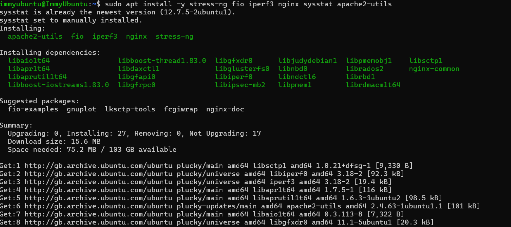
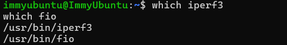
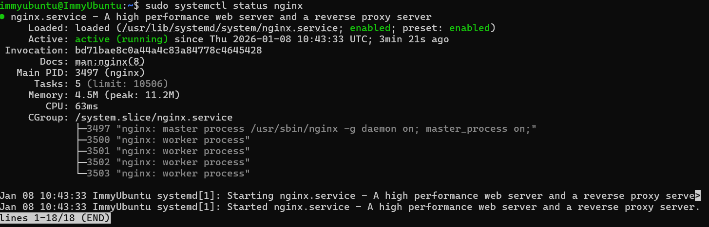

# Phase 3 – Application Selection for Performance Testing 

## Objectives
Select applications representing different workload types for performative evaluation
---

## 1. Application Selection Matrix  

## 2. Installation Documentation 

### SSH Connection Verification

As you can see at top there is my username, which shows that my SSH is connected to my Ubunutu server

### Package List Update ###

Here you can see me update the package list, this is so the terminal knows exactly what package I want 

### Application Installation ###

Here are my packages being installed which are described above in my application selection matrix 

### Installation Verification ###

Here is my vertification of the installation of the packages and the output from that 

### Nginx Service Verification ###

Lastly here I am verifying my ngnix service to show its running 

## 3. Performance Testing plan 

## 4. Performance Testing plan 

