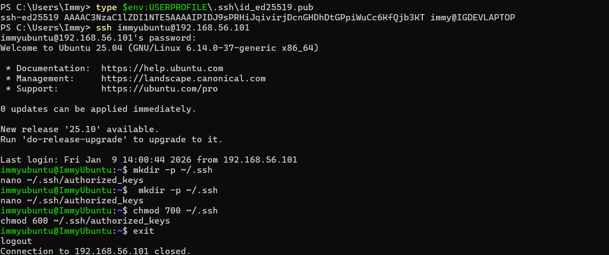
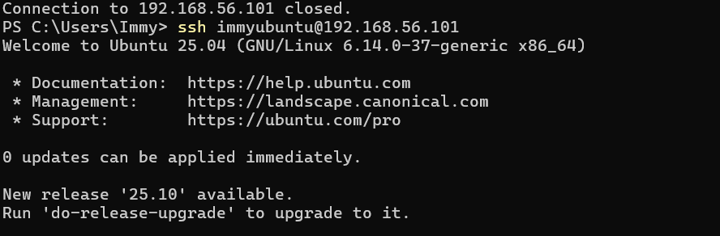
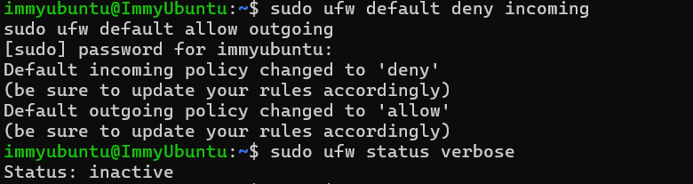
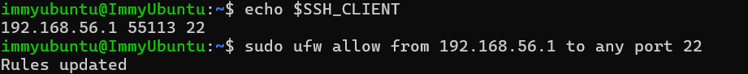
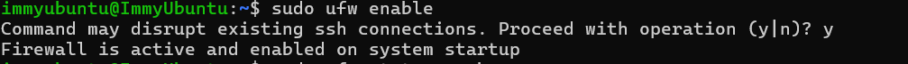
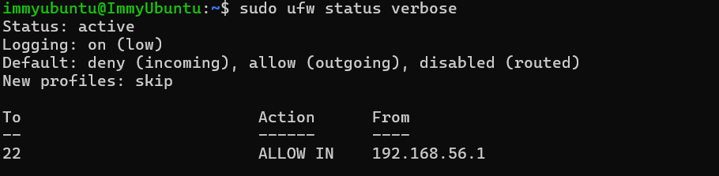
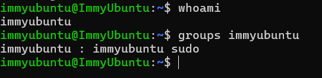
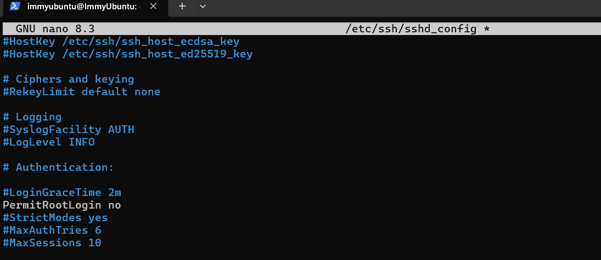
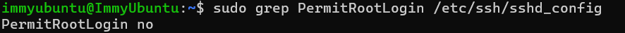

# Phase 4 – Intial System Configuration & Security Implementation 

## Objectives
Deploy your server and implement foundational security controls 
---

## 1. Configure SSH with Key-based authentication  

### a. Creating a Public and Private Key on my Host Machine

### b. Manually Adding the Public Key to my Ubunutu Server

This is because windows requires you to do it manually 

### c.  Vertifying my Key-Based Authentication (No password needed!)

## 2. Firewall Configuration (SSH from one specific workstation)

### a. Setting Default Policies

Here I am denying all incoming and allowing outgoing (for internet connections), although we are setting up the policies are here they are still ineffective until the firewall is enables 

### b. Allowing SSH from my laptop access only

Firstly I looked up the ip of my laptop's ssh session so I was connecting my specific workstation only 

### c. Enabling the firewall 

For my policies and my firewall to be active I need to enable the firewall using the above command 

### d. Verifying the Firewall

As you can see from the screenshot above, the firewall is now active 

## 3. Manage users/privellege management, creating a non-root administrative user 

### a. Declaration of Who Am I 

In the screenshot I showing how I am not root and have sudo privelleges 

### b. Disabling the Root

To do this I log into the nano file and change the comment of PermitRootLogin to no from yes and remove the # so it can be implemented 

### c. Restart/ Updating security Configuration

Here I am restarting with no error, this shows I have updated the security configuration  

### d. Verifying the Root

As you can see from the screenshot above, the root is verified to have a disabled root, showing I implement privilege management

## 4. SSH Access Evidence 

Showing a successful connection 

## 5. Configuration Files with before and after comparisons 

### Before: SSH Configuration

## 6. Firewall Documentation 

## 7. Remote Adminstration Evidence 

