# Phase 5 – Advanced Security and Monitoring Infrastructure 
## Objectives
Implementation advanced security control and develop monitoring capabilities 
---

## 1. Implement Access Control using SELinux or AppArmor , with documentation showing how to track and report on access control settings 

In this case, as i'm operating an ubunut server my MAC will be AppArmor. 

### a. Confirming App Armour is Installed 

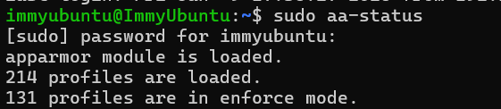

This shows how I have the MAC installed on my server, evidencing that it exists to track and report on access control settings

### b. Confirming App Armour is running 

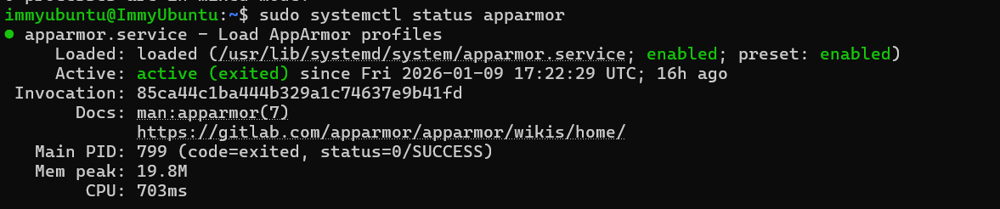

This shows that App Armour is not only installed but actively running

### c. Presenting loaded App Armour profiles 

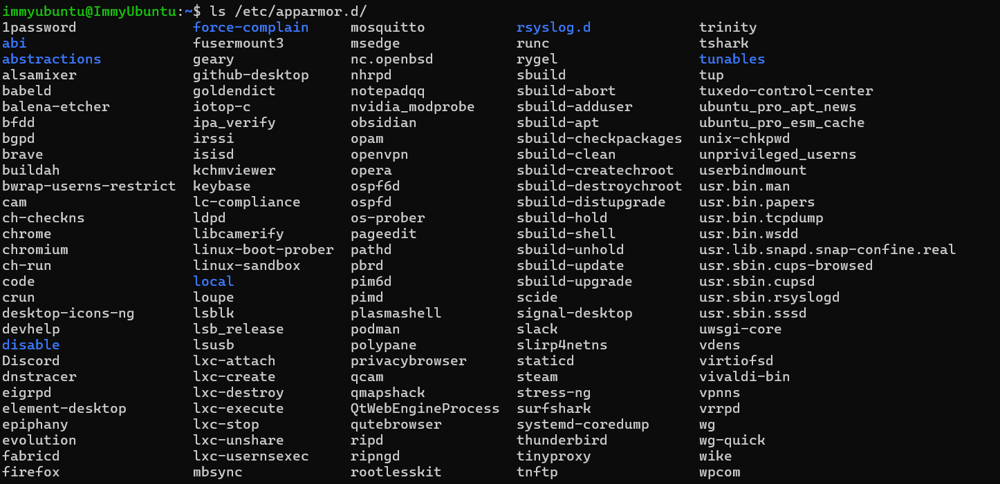

This shows which profiles are currently being tracked and reported on in the access control setting 

### d. Demonstrating the Profiles being enforced 

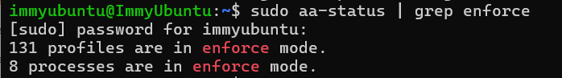

The enforcement status of AppArmor profiles was reported, confirming that profiles are actively enforced rather than operating in complain mode

## 2. Configure Automatic Security Updates 

### a. Confirming unattended-upgrades are installed

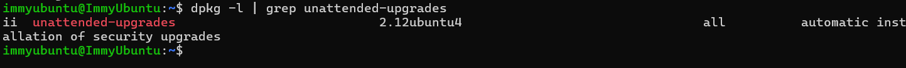

Firstly I checked that the automatic update package was installed

### b. Enabling Automatic Updates

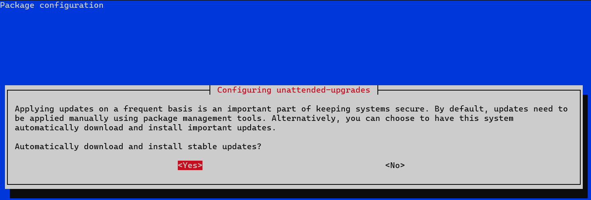

Here I am enabling the automatic updates 

### c. Configuration file 

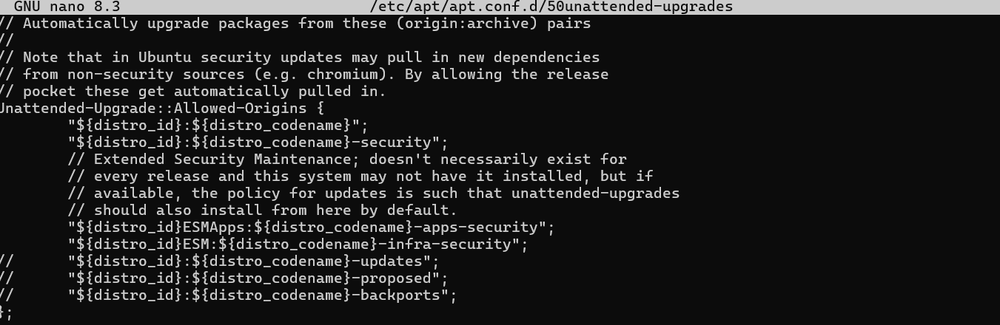

By opening up the configuration file I am showing how the securiity repositeries are listed and enabled meaning they will be installed with no intervention 

### d. Verifying Periodic Update Settings 

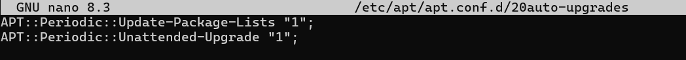

This screenshot shows that automatic updates actually run on a scedule, the 1 means they enabled 

### e. Verifying Service and Logs 

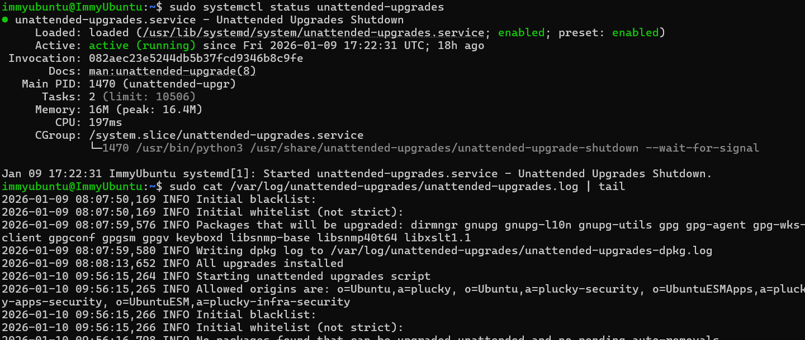

Here you can see you the service running confirmation and the logs confirming its active 

## 3. Configuration of Fail2ban

Fail2Ban is an intrusion prevention tool. It monitors log files and automatically blocks IPs with too many failed login attempts.

### a. Install Fail2Ban 
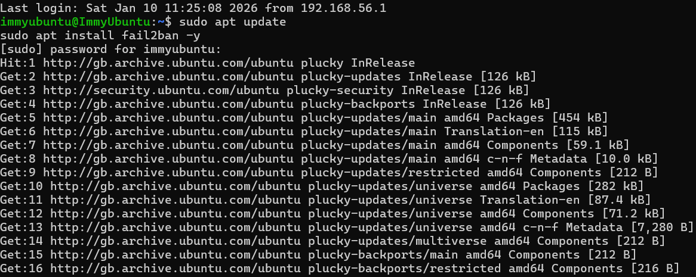

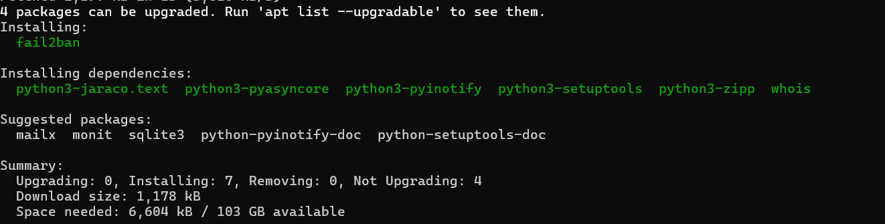

Seen in the screenshots above, I have installed Fail2Ban, I screenshotted parts of the installation message as it was rather long 

### b. Check Fail2Ban Status 

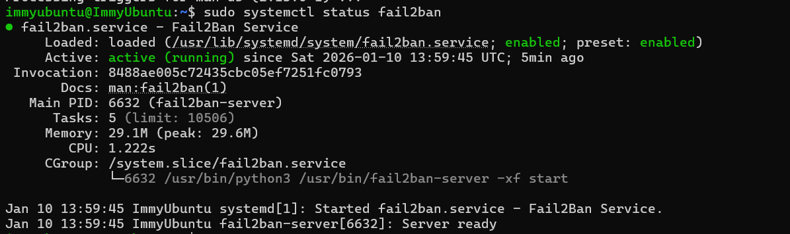

Here I am jsut checkign the status and as you can see it is running 

### c. Checking Jail Configuration

Jail  = A set of rules that define what to monitor and how to respond 

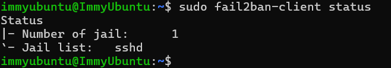

In this screenshot you can see what is being monitored and the jail configured. As I just installed Fail2Ban the default 1 jail for SSH is being shown 

### d. Showing Jail Information 

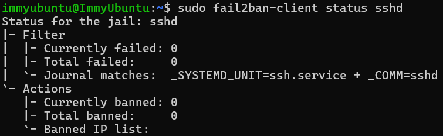

This is a log of what attemeotes and bands have been made, showign that my Fail2Ban is being enforced
