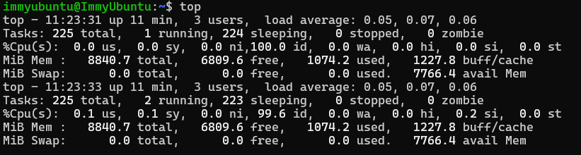

# Phase 6 – Performance Evaluation and Analysis
## Objectives
Execute detailed performance testing and analyse operating system behaviour under different workloads 
---

## 1. Documentation 

#### What is being tested? ####
In this particular project the whole system performance, including CPU, Memory, Disk and Network load, usage and latency is being tested. The system in question is my ubuntu server which I have accessed through a SSH connection through my host laptop.

#### What metrics are being used? ####
The metrics being used include:

- CPU load & usage
- Memory usage
- Disk usage
- Network/system latency
- Service response time (SSH)

#### How will testing be conducted? ####
Tesing will be conducted through 4 main parts:
1. Baseline Performance testing
2. Application load testing
3. Performance Analysis
4. Optimisation testing

## 2. Performance Data Table 

## 3. Performance Visualisations

## 4. Testing Evidence 

Firstly I will show the installation of sysstat which is the performance monitoring toolkit I will be using 

### a. Baseline Performance Testing

First I will test/collect the performance metrics at baseline meaning that they are idle, this is before I run them through stress tests which will ultimatley give and insight into how they are working 

#### CPU load ####

#### CPU Usage ####

#### Memory Usage ####

#### Disk Usage ####

#### Network Performance #### 

#### System Latency ####

As seen in the screenshot above commands seem to return instantly, showign how the operating system opperates quickly

#### Service Response Times ####

Both the SSH login and the commands appear immediately showing the response time is immediate

### a. Application Load Testing

## 5. Network Performance Analysis 

## 6. Optimisation Analysis
