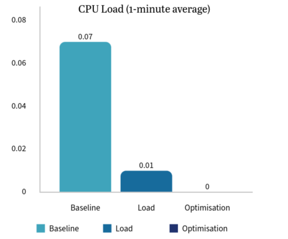
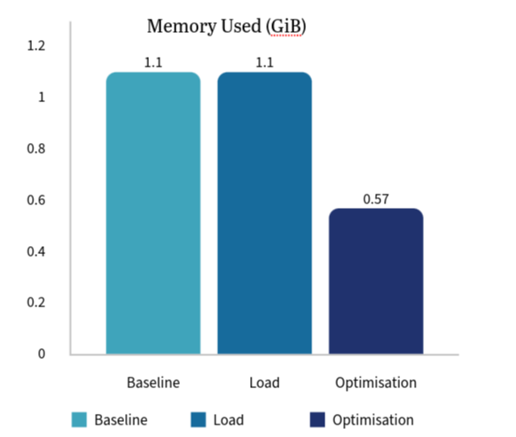
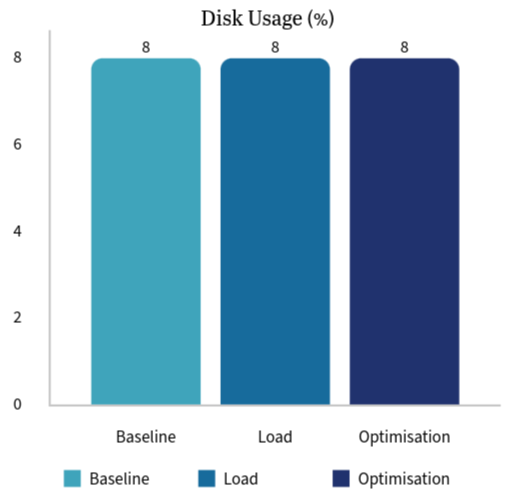
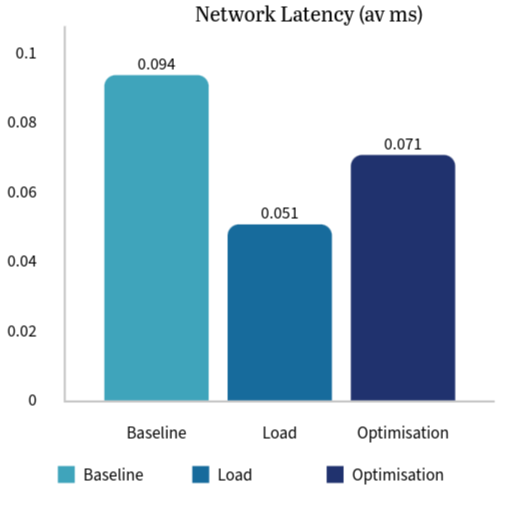
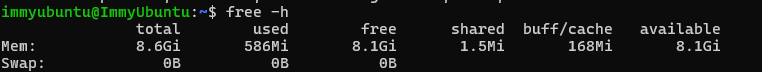
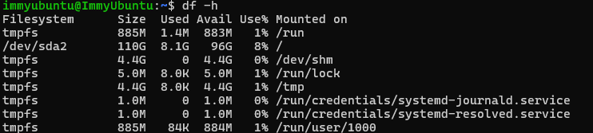
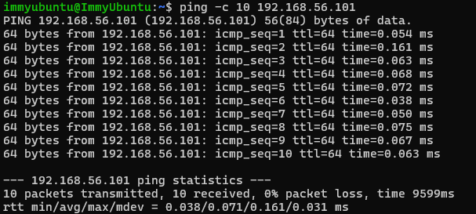

# Phase 6 – Performance Evaluation and Analysis
## Objectives
Execute detailed performance testing and analyse operating system behaviour under different workloads 
---

## 1. Documentation 

#### What is being tested? ####
In this particular project the whole system performance, including CPU, Memory, Disk and Network load, usage and latency is being tested. The system in question is my ubuntu server which I have accessed through a SSH connection through my host laptop.

#### What metrics are being used? ####
The metrics being used include:

- CPU load & usage
- Memory usage
- Disk usage
- Network/system latency
- Service response time (SSH)

#### How will testing be conducted? ####
Tesing will be conducted through 4 main parts:
1. Baseline Performance testing
2. Application load testing
3. Performance Analysis
4. Optimisation testing

* Multiple SSH sessions were used to interact with the same server concurrently. One session executed the stress test, while another collected performance metrics, allowing real-time observation of system behaviour under load

### Conclusion: ###
In conclusion, this phase evaluated the performance of my Ubuntu server under baseline, load, and optimised testing. By monitoring CPU, memory, disk, and network behaviour the system’s performance was evaluated. The results presented  that although baseline performance was already stable, optimisation steps such as stopping unnecessary services and managing memory usage improved overall efficiency and consistency. These findings provided a solid foundation for further performance analysis  evaluation in subsequent deliverables.

## 2. Performance Data Table 

## 3. Performance Visualisations

#### CPU load ####

#### Memory Usage ####

#### Disk Usage ####

#### Network Performance #### 

## 4. Testing Evidence 

Firstly I will show the installation of sysstat which is the performance monitoring toolkit I will be using 

### a. Baseline Performance Testing

First I will test/collect the performance metrics at baseline meaning that they are idle, this is before I run them through stress tests which will ultimatley give and insight into how they are working 

#### CPU load ####

#### Memory Usage ####

#### Disk Usage ####

#### Network Performance #### 

#### System Latency ####

As seen in the screenshot above commands seem to return instantly, showign how the operating system opperates quickly

#### Service Response Times ####

Both the SSH login and the commands appear immediately showing the response time is immediate

### b. Application Load Testing

Here I am activating the load test:

I made sure to open up a new SSH session because that allows me to run my commands at the same time the stress running which will lead to more accurate results, this is seen in the screenshot below

#### CPU load ####

#### Memory Usage ####

#### Disk Usage ####

#### Network Performance #### 

#### System Latency ####

System latency is slightly higher because Commands like uptime, free -h take slightly longer to return than baseline, because CPU/memory is being used.

#### Service Response Times ####

Service response time was slightly delayed, as SSH commands and login requests took marginally longer under load

### C. Optimisation Testing 

As a requirement of this section I had to make at least two improvements to my system which would make my server more optimal: I opted to stop unnecessary services and clear my cache memory 

#### Improvement 1: Stopping unnecessary services ####

First I had to look all my services running as a whole so I could find ones I could stop that wouldn't impact the running of my server 

So when I did this the two unnecessary services I decided to stop were the Gnome Display Manager (GDM) because I don't need a graphical login interface and secondly I decided to close the priniting functions (cups) as I won't use this either

I then brought up my running services again so I could double check that they were not running seen in the proof below 

#### Improvement 2: Clearing my Memory Cache ####
For the second improvement, all I had to do was jsut run the command below to clear my memory cache

#### Results of the Optimisation Testing: ####

#### CPU load ####

#### Memory Usage ####

#### Disk Usage ####

#### Network Performance #### 

#### System Latency ####
After Optimisation testing, System latency stayed low because the reduction in runnning services meant a reduction in CPU overhead and general process scheduling

#### Service Response Times ####
Response time with the optimisation testing returned to immediate as the freeing oF memory from clearing the cache and stopping non essential services means that memory is readly available and so the service's response time becomes immediate.

## 5. Network Performance Analysis

Within this phase I used to the ping request to send to my ubuntu server in order to measure network latency, this has been documented throughout this particular phase. Throughput, although not measured directly has still been monitored as the low latency and zero packet lost indiicates that the network throughput is more than efficient for this server. 

In evaluating the results, starting with the baseline at 0.07ms, this indicated that our baseline was at a low latency local nectwork connection between my host and the ubuntu server via SSH. Then once I completed the load testing this dropped down to 0.051ms, this is because it was mainly the CPU and Memory that was under stress during the testing which lead to a shortage in network congestion. Finally in response to the optimisation test in which unneccesary services stopped and background activity reduced the network latency stabalised at 0.071ms, proving that my server has a consistent low network latency.

## 6. Optimisation Analysis

In undergoing my optimisation testing I first decided to identify any potential bottlenecks, this is because in order to have test my server in a optimum envriroment I need to highlight what could possibly be holding back my server. Ultimtely my performance analysis showed me that running services such as the GDM and Printing services was an inefficient use of memory and cpu because neither were required by the task at hand, for example, using the GDM is pointless because this project is cenetered around a headless SSH connection, and no printing is required either. Furthermore another bottleneck I identified was the excessive use of memory from cached background processes. I will now go through each benchmark and how optimisation testing impacted them 

### CPU Performace ###
During the baseline testing CPU was already pretty low, coming in at only 0.07, thus showing that it wasn't under much stress at all. However as seen in looking for bottlenecks it was pointless background services that still took up CPU load. During optimisation testing these background services were eventually stopped resulting in a reduction of background CPU activity, as a result this test showed the lowest of the CPU averages, illustrating that it reduced overhead and ultimiately increased efficiency 

### Memory Performance ###
For Memory the baseline was 1.1 GiB despite no specified active workloads were operating. This meant that there was definetly some inefficient memory storage most likely caused by background and cached processes. After optimisation, memory usage decreased significantly to approximately 0.57 GiB, confirming that by stopping these unnecessary services and clearing cache, memory resources could be freed.

### Disk Performance ###
The disk usage was consistenly at 8% however this was expecteded as I didn't add anything to test the disk workload. This is because the optimisation testing was more focuses on freeing memory and the running of services.

### Network Performance ###
Network Latency reamined reasonsably stable across the testing environments. This shows us that the removal of background processes didn't do much to put a stress on network latency.

### System Latency ### 
System Latency started relativel low, this is because the baseline testing had a minimal load. After optimisation, system latency remained low but became more consistent as fewer background processes competed for system resources.

### Service Response Time ###
Service response time was measured through how responsive the SSH was and how fast commands were execution. During baseline testing response times were immediate. Under load testing there were slight delays due to increased CPU and memory usage. Following optimisation testing SSH responsiveness and command execution returned to the standard immediate response, thus demonstrating that optimisation helped maintain service performance even under testing conditions.
