# Phase 6 – Performance Evaluation and Analysis
## Objectives
Execute detailed performance testing and analyse operating system behaviour under different workloads 
---

## 1. Documentation 

#### What is being tested? ####
In this particular project the whole system performance, including CPU, Memory, Disk and Network load, usage and latency is being tested. The system in question is my ubuntu server which I have accessed through a SSH connection through my host laptop.

#### What metrics are being used? ####
The metrics being used include:

- CPU load & usage
- Memory usage
- Disk usage
- Network/system latency
- Service response time (SSH)

#### How will testing be conducted? ####
Tesing will be conducted through 4 main parts:
1. Baseline Performance testing
2. Application load testing
3. Performance Analysis
4. Optimisation testing

* Multiple SSH sessions were used to interact with the same server concurrently. One session executed the stress test, while another collected performance metrics, allowing real-time observation of system behaviour under load

### Conclusion: ###

## 2. Performance Data Table 
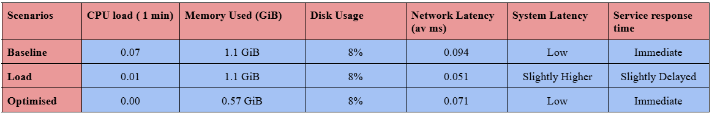

## 3. Performance Visualisations

## 4. Testing Evidence 

Firstly I will show the installation of sysstat which is the performance monitoring toolkit I will be using 

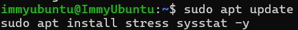

### a. Baseline Performance Testing

First I will test/collect the performance metrics at baseline meaning that they are idle, this is before I run them through stress tests which will ultimatley give and insight into how they are working 

#### CPU load ####
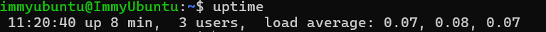

#### Memory Usage ####
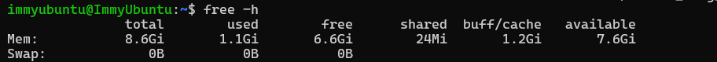

#### Disk Usage ####
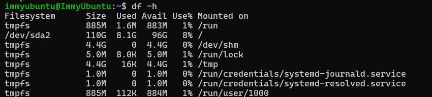

#### Network Performance #### 
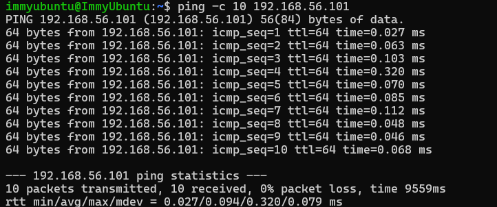

#### System Latency ####
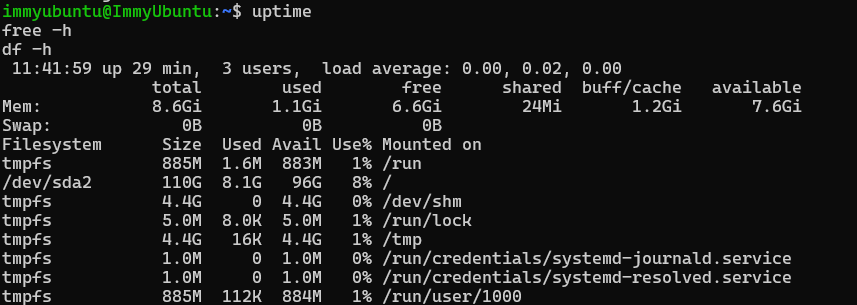

As seen in the screenshot above commands seem to return instantly, showign how the operating system opperates quickly

#### Service Response Times ####
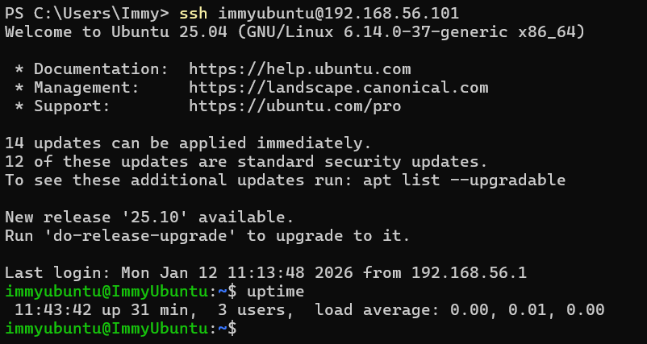

Both the SSH login and the commands appear immediately showing the response time is immediate

### b. Application Load Testing

Here I am activating the load test:
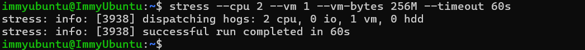

I made sure to open up a new SSH session because that allows me to run my commands at the same time the stress running which will lead to more accurate results, this is seen in the screenshot below
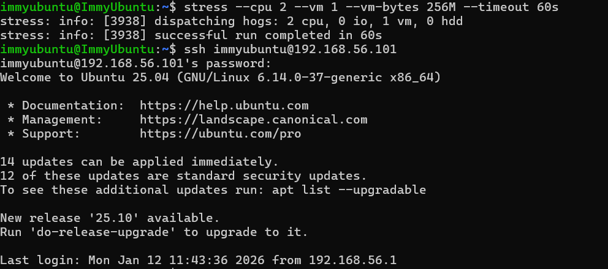

#### CPU load ####
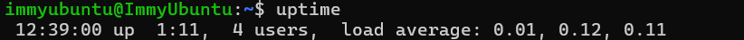

#### Memory Usage ####
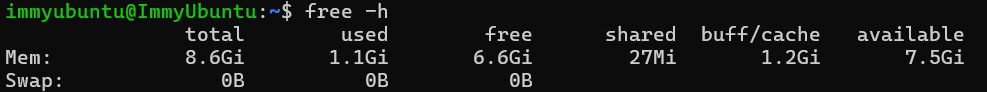

#### Disk Usage ####
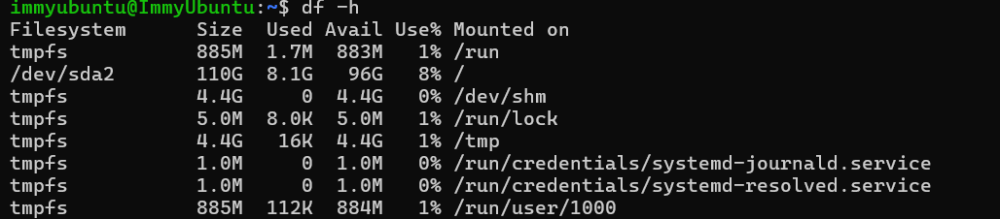

#### Network Performance #### 
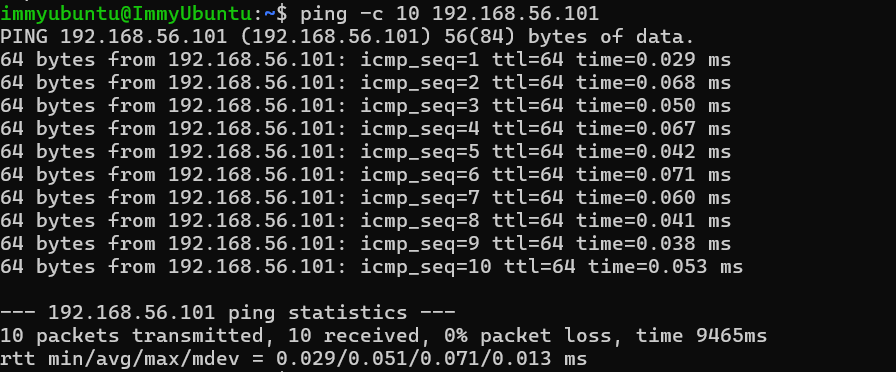

#### System Latency ####

System latency is slightly higher because Commands like uptime, free -h take slightly longer to return than baseline, because CPU/memory is being used.

#### Service Response Times ####

Service response time was slightly delayed, as SSH commands and login requests took marginally longer under load

### C. Optimisation Testing 

As a requirement of this section I had to make at least two improvements to my system which would make my server more optimal: I opted to stop unnecessary services and clear my cache memory 

#### Improvement 1: Stopping unnecessary services ####

First I had to look all my services running as a whole so I could find ones I could stop that wouldn't impact the running of my server 
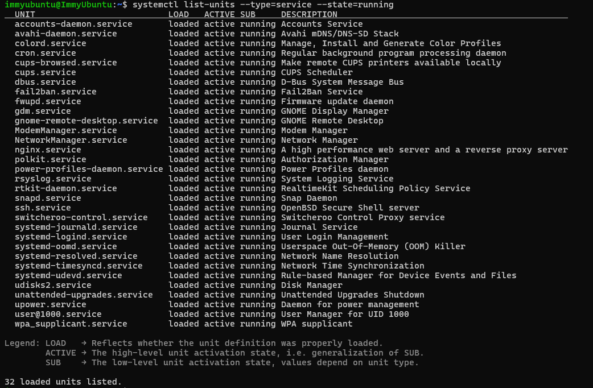
So when I did this the two unnecessary services I decided to stop were the Gnome Display Manager (GDM) because I don't need a graphical login interface and secondly I decided to close the priniting functions (cups) as I won't use this either
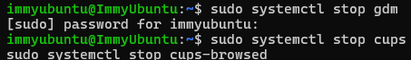
I then brought up my running services again so I could double check that they were not running seen in the proof below 

#### Improvement 2: Clearing my Memory Cache ####
For the second improvement, all I had to do was jsut run the command below to clear my memory cache 
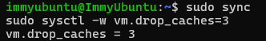

## 5. Network Performance Analysis

## 6. Optimisation Analysis
