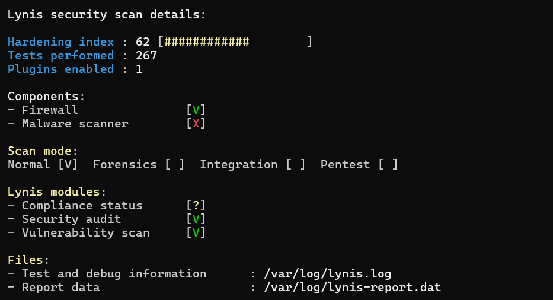
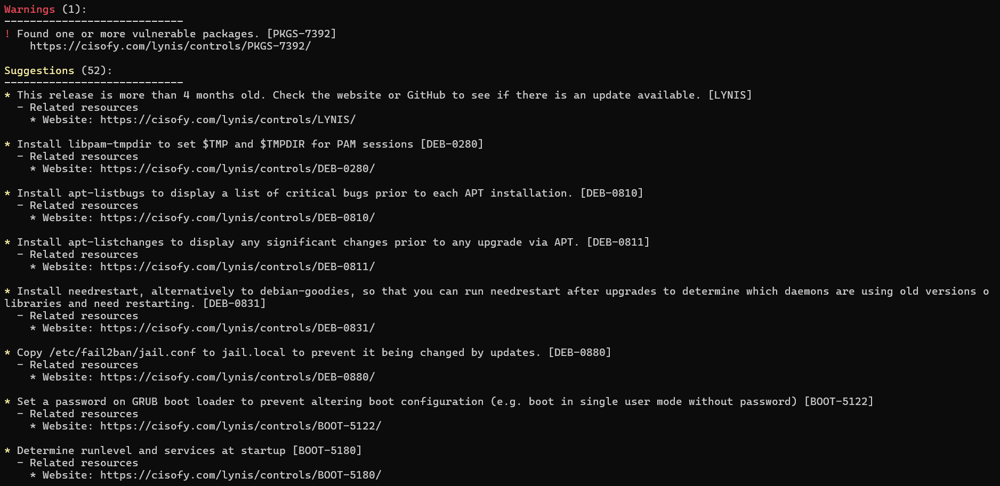
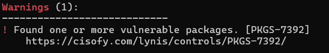
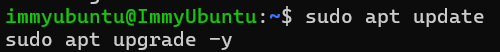
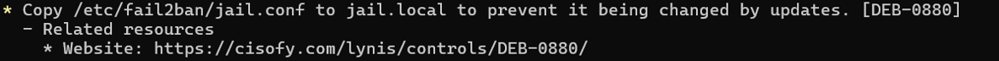
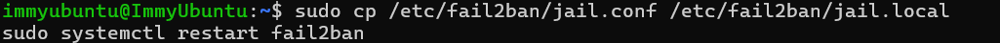
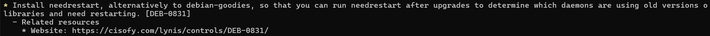
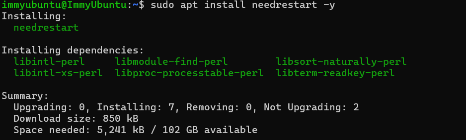
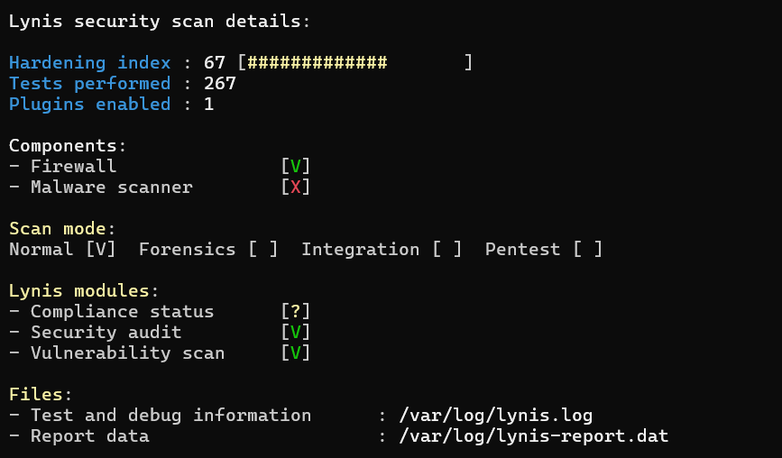
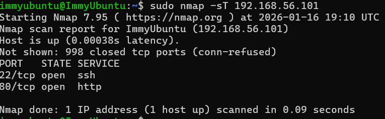

# Phase 7 – Security Audit and System Evaluation 
## Objectives
Conduct a security audit and evaluate overall system configuration
---

## 1. Security Audit Report

### a. Running the Baseline Security Audit (Lynis)

Firstly in order to understand what changes I could make to the security of my system I ran a Lynis Security audit, I did this before so I could see its suggestions and warnings and also get a hardening score, so I can compare my system after the changes and see if it has increased, showing an increase in the system's overall efficiency 

#### Baseline Hardening Score ####

#### Warnings and Suggestions ####

This screenshot only shows a small percentage of the suggestions as there was a multitude of them.

### b. Rectifying the Warning ###
When I ran the Security Audit the only warning that came up was one that warned me that some of my packages had some vulnerabilities which translates that not all packages were fully patched, leading me open to surface level attacks 

#### Solution: ####
I decided to just enable unattended security updates, this means that my system will automatically update itself to protect against vulnerabilites 

### c.  Working on Suggestion 1 ###

The first suggestion I decided to take up was the suggestion to change Fail2Ban configuration protection,this is because Fail2Ban uses jail.conf which is a default file, meaning that it is open for package updates to overwrite it 

#### Solution: ####
In order to tackle package updates overwriting my file, I created a local override file which overrides defaults meaning my Fail2Ban stays consistent and isn't overriden.

### d.  Working on Suggestion 2 ###
The second suggestion I picked up was the one that recommended installing needrestart. This is because it scans all the running services after updates and highlights which ones are still using old libraries, thus needing a restart. This will help my server to be generally more secure and more efficient, especially since it will be taking advantage of the newest patch updates.

#### Solution: ####
As the suggestion wrote, I just installed needrestart on my server 

### d. Rerunning Lynis Again ###

After making some changes and recommendations I ran the test again and as you can see this has increased my hardening index by 5%

## 2. Network Security Assessment ##
In order to run a network security assessment I had to first install nmap. When the scan came back it proved that the network's security was good due to low risk, this is because the only two open ports were 22 for SSH and 80 for http (nginx) showing how it was only open for essential services 

## 3. SSH Security Verification ## 

As Port 22 is open, I'm just going to run a verification check to show you its the Remote access and is intentional

## 4. Service Audit ##

## 5. Access Control Verification ##

## 6. System Configuration Review & Remaining Risks ###

